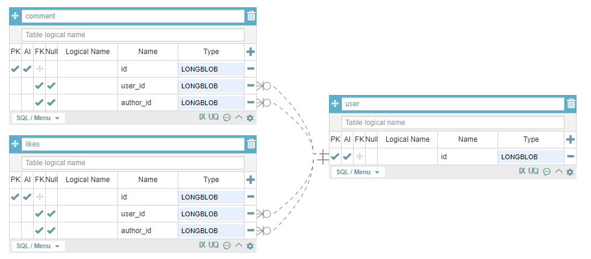
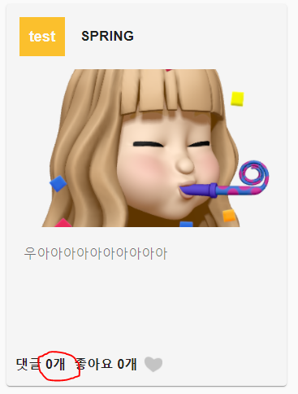
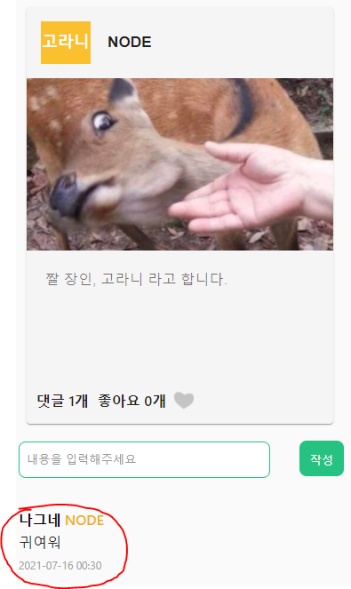
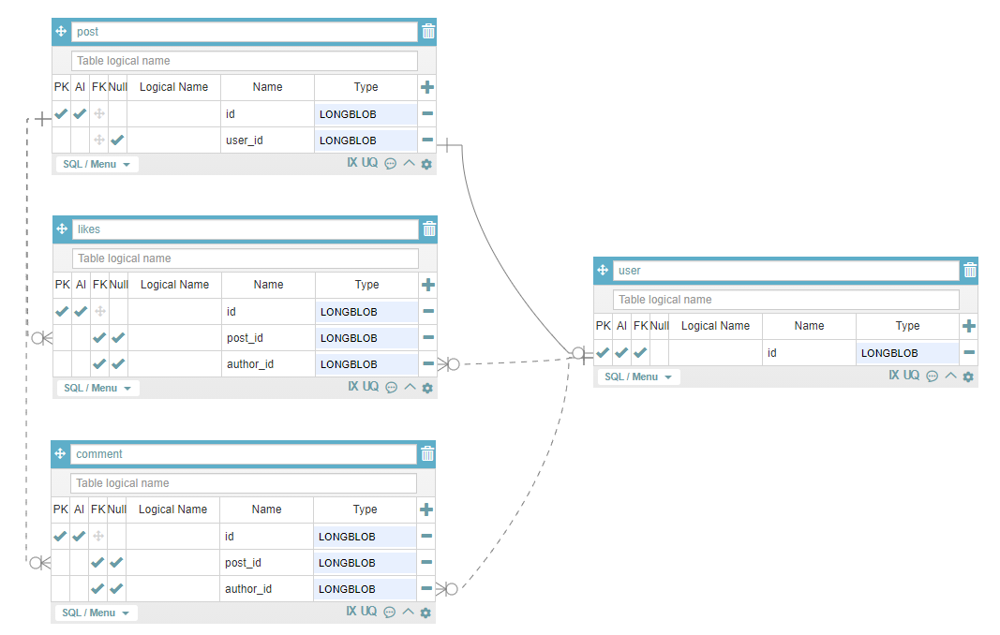

# devMateBackend

팀원 : 고원구, 김건우 (frontend)   
김도형, 이태경 (backend)   

작업공간 : 게더타운, 노션

* ## 결과
    * [프로젝트 링크](http://www.devmate.org/)
    * [유튜브 링크](https://www.youtube.com/watch?v=iSRJttPh7XU)
      <br>

* ## Project
    * <details>
      <summary>아아디어</summary>
      <br>

      향해99 2기 동기들의 숫자는 대략 130명,   
      하지만 이중에 20명도 알지 못하고 있어,   
      서로를 더 알기위해 만든 미니프로젝트입니다.   
      개발자를 뜻하는 'Dev"   
      동료를 뜻하는 "Mate"를 합쳐    
      프로젝트명 Dev-Mate로 정하였습니다.
      </details>
      <br>

    * <details>
      <summary>기능</summary>
      <br>
      
        * 회원가입/회원수정
        * 회원 이미지 S3 저장
        * 로그인/로그아웃   
          (SPRING SECURITY JSESSIONID)
        * 회원 조회  
        * 회원에게 좋아요/댓글 작성
        * 댓글 삭제

      </details>
      <br>

* ## Backend
    * <details>
      <summary>API 설계</summary>
        <br>
      
        /api
        * /user
            * method = POST
            * request = {username:"아이디",
              password:"비밀번호",
              name: "강호동",
              skill : "REACT",
              introduce : "안녕하세요!", image_url: "www.aws.s3.img.jpg"}
            * response = {res: true/false, msg: "회원가입이 성공하였습니다."}
            * 기능 = 회원가입
            
        * /user
          * method = GET
          * response = {res:true/false,
            msg: "회원이 조회되었습니다.",
            result: [ { id: user.id , name: user.name , skill: user.skill , introduce: user.introduce , image_url: user.image_url } , .... ]}
          * 기능 = 모든 회원을 조회합니다.

        * /user/{user_id}
          * method = GET
          * response = {res:true/false, msg: "단일 회원이 조회되었습니다.", result: {id: user.id , name: user.name , skill: user.skill , introduce: user.introduce , image_url: user.image_url, comments: [{author_id:author.id, content: comment.content, modified_at: localdatetime, created_at: localdatetime}, ... ] } }
          * 기능 = 단일 회원을 조회합니다.
            
        * /user?user_id={중복확인 아이디}
            * method = GET
            * request = ?user_id={중복확인 아이디}
            * response = {res=true/false, msg="아이디가 중복되었습니다."}
            * 기능 = 회원 가입 전 중복확인

        * /user/image
            * method = POST (multipartform / form)
            * request = {file : image}
            * response = {res=true/false, msg="이미지가 서버에 저장되었습니다.", image_url="www.aws.s3.img.jpg"}
            * 기능 = S3에 업로드된 이미지 저장, url 반환

        * /user/login
            * method = POST (form)
            * request = {username:아이디", password:"비밀번호"}
            * response = redirect "/"
            * 기능 = 스프링 부트 로그인
          
        * /comment?user_id={조회 유저}
          * method = GET
          * request = ?user_id={조회 유저}
          * response = {res: true/false, result:{author_id:comment.author_id, contents:comment.contents}
          * 기능 = 특정 유저의 모든 댓글 조회
          
        * /comment
          * method = POST
          * request = {contents: "댓글내용" ,
            user_id: "댓글이 달린사람의 id
            username: "댓글을 단 사람의 이름"}
          * response = {res: true/false, msg: "댓글이 작성되었습니다."}
          * 기능 = 댓글 작성

        * /comment/{comment_id}
          * method = DELETE
          * response = {res: true/false, msg: "삭제되었습니다."}
          * 기능 = 댓글 삭제

        * /comment
          * method = PATCH
          * request = {contents:"댓글내용"}
          * response = {res: true/false, msg: "수정되었습니다."}
          * 기능 = 댓글 수정

        * /likes
          * method = POST
          * request = {user_id: "좋아요가 달린사람 id"}
          * response = {res: true/false, msg: "좋아요가 작성되었습니다."}
          * 기능 = 좋아요 작성

        * /likes/{like_id}
          * method = DELETE
          * response = {res: true/false, msg: "좋아요가 삭제되었습니다."}
          * 기능 = 좋아요 삭제

    </details>
    <br>

    * <details>
      <summary>데이터베이스</summary>
        <br>

        * dev_mate
            * user
                * id = long
                * username = string
                * password = string
                * name = string
                * skill = enum(string)
                * introduce = string
                * image_url = sring
                * created_at = localDateTime
                * modified_at = localDateTime
            * comment
                * id = long
                * user_id = long
                * author_id = long
                * content = string
                * created_at = localDateTime
                * modified_at = localDateTime
            * likes
                * id = long
                * user_id = long
                * author_id = long
                * created_at = localDateTime
                * modified_at = localDateTime
    
    </details>
    <br>

    * <details>
      <summary>Mistakes were made</summary>  
      <br>
      
      다음은 저희 프로젝트의 데이터베이스를 fk와 pk로 간략화한 사진입니다.   
      
         
      
      논리적인 맥락에서는 이 관계는 성립할 수 있습니다.   
      저희의 서비스는 사람에게 댓글이나 좋아요를 하는 서비스입니다.   
      comment 는 작성자와 작성당한 사람이 동시에 필요합니다.    
      댓글을 쓴 사람과 댓글이 달린 사람입니다.   
         
      데이터베이스의 맥락에서도 이 관계는 성립할 수 있습니다.   
      2중 1:N 의 구조는 잘 알려져 있지 않지만 충분히 가능하다는 [stack overflow 문서입니다.](https://stackoverflow.com/questions/29356807/is-it-acceptable-to-have-2-one-to-many-relationships-between-2-tables)   
      실제 데이터베이스에 넣거나 받을 때에도 문제가 되지는 않았습니다.   
      
      다만 정말 큰 문제는 json 으로 받을 때의 recursion 에 있었습니다.   
      
      jackson recursion 에러가 발생하면    
      @jsonIgnore, @jsonIdentityInfo, @ jsonManagedReference 쓰면 되는거 야냐?   
      하실 수 있으시지만 그렇게 단순한 문제가 아니였습니다... ㅜㅜ   
      
      <br>
      
      예를 들어 댓글을 받는 경우   
      메인 페이지는   
      array[user] -> array[comment] -X> user    
      모든 유저들의 array -> 각각 유저들에게 작성된 comment array -X> 각각 comment 를 작성한 user     
      위에서 표현된 -X> 는 연결을 끊는다는 의미로   
      @jsonIgnore, @jsonIdentityInfo, @ jsonManagedReference 중 아무것이나 사용하셔도 됩니다.   
      
      메인 페이지의 경우 연결을 끊어낼 수 있습니다.   
      메인 페이지에서 받는 정보가 comment 의 갯수만 필요해서 array[comment] 만 있어도 되기 때문입니다.   
      
         
      메인에서 필요한 array[comment].length    
      
      <br>
      
      하지만 user 페이지의 경우 어떨까요?    
      
          
      댓글에는 user의 정보가 포함되어야 합니다.    
      
      유저 정보 -> 유저들에게 작성된 comment array -> 각각 comment 를 작성한 user 정보   
      의 연결관계가 정의되어야 합니다.   
      즉 user -> comment -> user 로 한번의 루프가 일어나야 한다는 것입니다.   
      그럼 user -> comment -> user -> comment -> user -> comment ... 지옥이 시작됩니다.   
      
      이는 @json annotation 들로는 해결할 수 없습니다.   
      뒤의 연결관계를 끊어내면, 앞의 연결관계가 끊어지게 됩니다.   
      즉   
      user -> comment -> user -X> comment 가 되면         
      user -X> comment -> user -X> comment 가 됩니다.    
      
      <br>
      
      따끈따끈 새로나온 @jsonView 로도 해결이 불가능합니다.      
      @jsonView 는 @controller 의 request 마다 어떤 결과는 표시하고 어떤 결과는 나타내지 않는 기능입니다.    
      
      메인과 상세페이지의 json 표시 결과를 다르게 하면 되지 않을까 생각 하였지만,    
      상세 페이지는 메인 페이지와 아무런 관계가 없는 독자적인 문제였습니다.   

      아무리 메인 페이지와 상세 페이지를 구별해도 결국은   
      user -> comment -> user -X> comment 문제가 된다는 의미입니다.   

      <br>
      
      생각해본 해결책    
      
      처음 생각해본 해결책은 jsonIdentityInfo 에 다중 결과를 반환하는 것이였습니다.   
      그러나 바로 다중 결과 반환이 불가능하다는 것을 알게 되었습니다. ㅋㅋㅋㅋ
      
      그 다음으로 생각해본 방법은   
      identityInfo 로 받은 user 의 아이디로 query 를 날려 결과에 반환하는 것이였습니다.   
      그러나 이 방법은 전혀 최적화되어 있지 않습니다.      
      댓글이 많은 회원의 경우 각 댓글을 단 사람의 정보를 database 에서 받아와야 합니다.   
      
      생각을 이어가던 중 제가 도달한 결론을 먼저 말씀드리면   
      1. post 테이블을 만든다.
      2. jpql 을 직접 작성한다.
        
      이 방법들은 전혀 전문가의 입에서 나오는 소리가 아닌,    
      초보자의 고찰일 뿐입니다. 이것을 정답으로는 생각해주지 마세요.      
      방법은 이것보다 훨씬 많을 것입니다.    
      
      우선 a는   
      
          
    
      post 라는 table 을 만들어 jackson recursion 을 피하는 방법입니다.    
    
      post 라는 table 이 생긴다면   
      메인페이지의 경우   
      
      array[post] -> array[comment] -> array[user] 가 됩니다.    
      
      상세페이지도 마찬가지로   
      
      post -> array[comment] -> array[user] 가 됩니다.   
      
      즉 post, comment, user 에서 json 이 끊어질 수 있어 문제가 해결됩니다.   
    
      다만 이 해결책에는 단점이 있습니다.   
      
      user 의 정보가 곧 post 의 정보에 해당되는 저희 프로젝트는,   
      user가 생성, 수정, 삭제 될때마다 post 도 따라서 생성, 수정, 삭제해야 한다는 것입니다.   
      물론, 삭제의 경우 cascade 를 사용할 수 있겠지만,   
      사용자의 세부정보까지 연동되야 하는 생성, 수정의 경우 낭비가 일어납니다.    
      그럼으로 전혀 최적화된 방법이라고 할 수 없습니다.   
      
      <br>
      
      그럼으로 생각한 b 는      
      @query 을 사용하는 방법입니다.   
      
      user join comment join user 로 3번까지만 join 정의를 해버리는 것입니다.    
      물론 이제 같은 user 의 테이블이 조인 되는 것이라서 column 이 중복될 것입니다.   
      user a, user b 로 a_username, b_username 으로 보통 sql 에서 해결할 수 있습니다.   
      이 프로젝트는 5일이라는 짧은 시간과 프런트가 어려워서 도움을 주러 가서 삽질할 시간이 부족해 아쉽게도 적용되어 있지 않습니다.   
      프로젝트가 끝나고 몇일 이후에 적는 readme 이지만 그럼에도 @query 를 한번 제대로 배워보고 싶은 생각이 물씬 드는 문제였습니다.      
      </details>
      <br>
      
    * <details>
      <summary>CORS</summary>  
      <br>

      Cors 는 시행착오를 많이 거쳤습니다.      
      stack overflow 에는 cors 를 해결하기 위한 수많은 spring code 들이 존재하지만 그 중에서 가장 
      단순하고 가장 효과적인 코드를 찾아야 했습니다.   
      
      찾고 사용했던 코드들   
      CORS FILTER   
      ```java
      // TODO : 해당 클래스의 내용을 readme 에 정리하고 삭제하기
      @Deprecated
      @Component
      @Order(Ordered.HIGHEST_PRECEDENCE)
      public class CORSFilter implements Filter { 
          @Autowired
          private DomainConfig domainConfig;
      
          @Override
          public void doFilter(ServletRequest req, ServletResponse res, FilterChain chain) throws IOException, ServletException {
              HttpServletResponse response = (HttpServletResponse) res;
              HttpServletRequest request = (HttpServletRequest) req;
      
              // header 를 필요에 맞게 변경할 수 있습니다.
              response.setHeader("Access-Control-Allow-Credentials", "true");
              response.setHeader("Access-Control-Allow-Origin", "http://localhost:3000");
              response.setHeader("Access-Control-Allow-Methods", "GET, POST, PATCH, GET, DELETE");
              response.setHeader("Access-Control-Max-Age", "3600");
              response.setHeader("Access-Control-Allow-Headers", "content-type");
      
              if ("OPTIONS".equalsIgnoreCase(request.getMethod())) {
                  response.setStatus(HttpServletResponse.SC_OK);
              } else {
                  chain.doFilter(req, res);
              }
          }
      
          @Override
          public void init(FilterConfig filterConfig) {
          }
      
          @Override
          public void destroy() {
          }
      }
      ```   
      위 코드는 강제적으로 controller 의 모든 header 에 cors 허용을 붙입니다.   
      
      이 코드베이스는 별로 추천드리지 않습니다.   
      우선 저기 위의 @Order(Ordered.HIGHEST_PRECEDENCE) 가 보이실 겁니다.   
      이는 강제성을 가지는 것과 같은 효과가 있습니다.   
      @Order(Ordered.HIGHEST_PRECEDENCE) 없이는 작동하지 않습니다.   
      그럼으로 스프링의 코드베이스를 조작하는 것과 같은 의미를 가집니다.   
      
      Spring 은 웹 api 를 만들기 위한 template 입니다.    
      Template 은 사용하는 것이지 뜯어 고치는 것이 아닙니다.    
      
      이러한 방법을 사용하지 말고 spring 에서 의도한 방법을 찾아보는 것이 좋을 것 같았습니다.   

      `@CrossOrigin(origins = {"devmate.org"}, allowCredentials = "true")`   
      다음과 같은 @CrossOrigins 를 controller class 앞에 사용해주신다면 훨씬 더 깔끔하고 
      스프링에서 의도된 도구를 사용한다고 생각되어 @CrossOrigin 으로 변경하였습니다.   
      
      다만 security 는 또 다른 문제였습니다.   
      ```java
      @Configuration
      @EnableWebSecurity // 스프링 Security 지원을 가능하게 함
      @EnableGlobalMethodSecurity(securedEnabled = true)
      public class WebSecurityConfig extends WebSecurityConfigurerAdapter {
      @Autowired
      private DomainConfig domainConfig;
      
          @Bean
          public BCryptPasswordEncoder encodePassword() {
              return new BCryptPasswordEncoder();
          }
      
          @Bean
          @Override
          public AuthenticationManager authenticationManagerBean() throws Exception {
              return super.authenticationManagerBean();
          }
      
          @Override
          protected void configure(HttpSecurity http) throws Exception {
              http.csrf().disable();
              http.headers().frameOptions().disable();
              
              @Depricated
              // TODO : 깃헙 readme 에 남기고 삭제하기 (security cors 설정법)
                http.cors().configurationSource(request -> {
                        var cors = new CorsConfiguration();
                        cors.setAllowedOrigins(Arrays.asList(domainConfig.getFullName()));
                        cors.setAllowedMethods(Arrays.asList("POST", "GET", "PUT", "DELETE", "PATCH", "OPTIONS"));
                        cors.setAllowedHeaders(Collections.singletonList("*"));
                        cors.setAllowCredentials(true);
                        return cors;
                });
      
              http.authorizeRequests()
                      // image 폴더를 login 없이 허용
                      .antMatchers("/images/**").permitAll()
                      // css 폴더를 login 없이 허용
                      .antMatchers("/css/**").permitAll()
                      .antMatchers("/user/**").permitAll()
                      .antMatchers("/h2-console/**").permitAll()
                      .antMatchers("/api/**").permitAll() // api테스트를 위해 열어두었습니다 배포시 주석처리해주세요
                      // 그 외 모든 요청은 인증과정 필요
                      .anyRequest().authenticated()
                      .and()
                      .formLogin()
                      //.loginPage(domainConfig.getFullName()+ "/login")
                      .loginProcessingUrl("/api/user/login")
                      // https://stackoverflow.com/questions/60826884/jwt-served-via-httponly-cookie-with-someway-to-find-out-is-logged-in
                      .defaultSuccessUrl(domainConfig.getFullName()+"/")
                      .failureUrl(domainConfig.getFullName() + "/login/?res=false")
                      .permitAll()
                      .and()
                      .logout()
                      .logoutUrl(domainConfig.getFullName()+"/redirect/logout")
                      .permitAll()
                      .and()
                      .exceptionHandling()
                      .accessDeniedPage("/user/forbidden");
          }
      }
      ```
      
      위 방법에서 `@Depricated` 된 `http.cors().configurationSource()` 이후의 cors 설정 부분이 security 의 요청들에 cors header
      를 달아주는 역활을 합니다.   

      `http.authorizeRequests()` 같이 `http.cors()` 를 만든 것으로 보아 spring 에서 의도한 방법에도 맞고 잘 되는 것 같이 보였습니다.      
      
      하지만 한가지 큰 문제점이 얼마 지나지 않아 나타났습니다.   
      
      Security 는 다른 도메인에 쿠키를 저장할 수 없습니다.
      
      이게 무슨 예기냐 하면   
      localhost:8080 에서    
      localhost:3000 에 jsessionid 를 지정할 수 없습니다.   
      
      자세한 [stack overflow 링크](https://stackoverflow.com/questions/6761415/how-to-set-a-cookie-for-another-domain) 는 여기에 올려드립니다.   
      그래서 제시된 해결책들을 읽던 와중에    
      
      a.devmate.org 에서 b.devmae.org 의 쿠키를 변동할 수 있다는 예기가 있었습니다.    
      spring 의 경우 이를 해결하는 방법은 application.properties 에서   
      `server.servlet.session.cookie.domain=devmate.org` 를 추가하는 것입니다.      
      servlet 은 spring 의 내부에서 사용되는 프레임워크입니다.   
      이 코드를 추가하시면 이제 security 에서 subDomian 에 쿠키를 변동할 수 있게 됩니다.   
      
      security 는 쿠키를 변동할 때마다 `Set-Cookie: JSESSIONID=value;` 를 주는데,   
      여기에  `domain=devmate.org` 가 붙으면 subdomain 에서도 접근이 가능한 쿠키로 변동됩니다.   
      header 가 `Set-Cookie: JSESSIONID=value; domain=devmate.org` 로 변경되는 겁니다.    
      이 역활을 `server.servlet.session.cookie.domain=devmate.org` 가 해주는 것이구요.   
      
      여기까지 다 끝난 이후에는 route53 를 이용하여 api.devmate.org 와 www.devmate.org 를 지정해주시면 됩니다.   
      
      이렇게 되면 위의 `http.cors()` 지정 또한 필요가 없어집니다.   
      <br>
      
      </details>
      <br>


* ## 협업
    * <details>
      <summary>git</summary>
      <br>
      
      백엔드는 브랜치를 아직 사용하지 않고 commit merge 만 조심하며 작성하였습니다.       
      원구님의 경우 front 에서 브랜치를 사용하셨습니다.
      </details>
      <br>

    * <details>
      <summary>notion</summary>
      <br>
      
      [Link](https://www.notion.so/21-3b3e8608d943459a93a9652418efd1b6)
      </details>

<br>

* ## 설치
    * <details>
      <summary>Route53, EC2, S3</summary>
      <br>
        
      </details>
